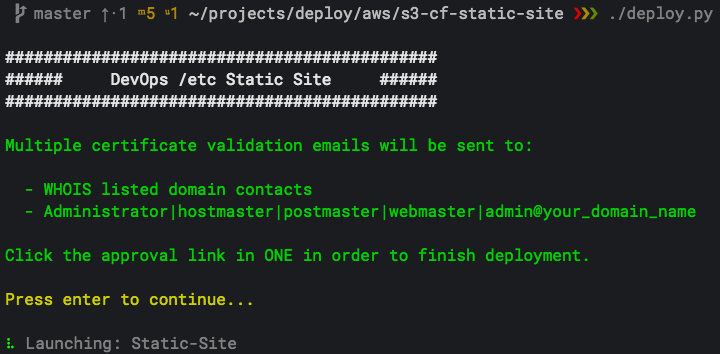
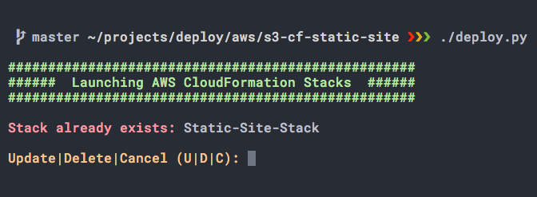

<h1>  DevOps /etc</h1>

### Automatic deployment of a secure, AWS S3-backed and CloudFront CDN-distributed, static website using Python, Boto3 and a CloudFormation stack.

Do you like setting up and maintaining that server that runs your blog? Do you like how slow your pages loads from the CMS's database? How about how much money you're spending on hosting?! Yuck, I don't at all, that's why I switched from a CMS to a statically generated site and migrated to an AWS S3 bucket served up by a CDN distribution using AWS CloudFront. This project, built with the AWS SDK for Python (Boto3) and CloudFormation, allows you to quickly deploy the requisite AWS infrastructure needed to streamline your blog setup and serve it up fast and inexpensively.

Code walkthrough and additional information can be found at:  [DevOpsEtc.com/post/ec2-keypair-rotation](https://DevOpsEtc.com/post/s3-cf-static-site)

**Features/Benefits:**
  * CloudFormation for quicker provisioning of repeatable and updatable AWS resources
  * CloudFront CDN distribution for faster pages loads
  * S3 bucket for managed server setup/maintenance/availability; autoscales as needed; no updating
  * ACM SSL/TLS certificate for secure page loading via HTTPS

**Prerequisites:**
  * MacOS High Sierra (will probably work on earlier MacOS versions and Linux, but YMMV)
  * Python 3: $ brew install python3
  * Python Modules: $ pip3 install boto3 awscli colorama (sudo may needed to run with elevated privileges)
  * Amazon Web Services account (if new to AWS, there's a year long free-tier plan available)
  * AWS credentials: $ aws configure (paste in access keys from AWS management console)
  * Custom domain name
  * AWS Route 53 hosted zone for custom domain name
  * Valid custom domain name email, catch-all, or forwarding address setup at registrar for certificate email validation

**Script Output Screenshots:**

  
 

**What Gets Provisioned:**
  * One ACM SSL/TLS certificate
  * One IAM group
  * One IAM group policy
  * One IAM user
  * Two S3 buckets
  * One CloudFront distribution
  * Two Route 53 DNS records

  All resources are provisioned in AWS region: us-east-1. The ACM certificate will not work with CloudFront if a different region is used. Running this script will launch an AWS CloudFormation stack that provisions, among other things, S3 buckets and CloudFront distributions, both of which incur minimal service fees... i.e. don't forget to delete the stack if no longer needed!

**Getting Started:**

    # Clone the repo on GitHub
    $ git clone https://github.com/DevOpsEtc/s3-cf-static-site ~/DevOpsEtc/s3-cf-static-site

    # Update domain name in ~/DevOpsEtc/s3-cf-static-site/deploy.py
    domain = 'devopsetc.com' # your bare domain name

    # Run script
    $ cd ~/DevOpsEtc/s3-cf-static-site && ./deploy.py

    # Running the script again will prompt: Update | Delete | Cancel. Choose "Update" if you've made a change to the CloudFormation (CFN) template that you'd like to be pushed to your installed CFN stack. Choosing "Delete" will rollback all changes introduced by the initial stack launch and any subsequent stack updates, and delete the CloudFormation stack.

    
 

    # Manually copy a file from local to S3 bucket
    # Special case bypass of git commit
    # Remember this S3 bucket has public read access
    $ aws s3 cp ~/path/to/file s3://your-your_domain_name

**Known Issues:**
- None

**Road Map:**
- Add static website boilerplate content
- Add instructions for Hugo static generator install and config
- Add Python function to create local/remote repos and push initial build to remote
- Add CloudFormation resources for CI/CD workflow (CodeCommit, CodePipeline, CodeBuild, CodeDeploy)

**Contributing:**
1. Review open issues
2. Open new issue to start discussion about a feature request or bug
3. Fork the repo, make changes, then send pull request to dev branch
